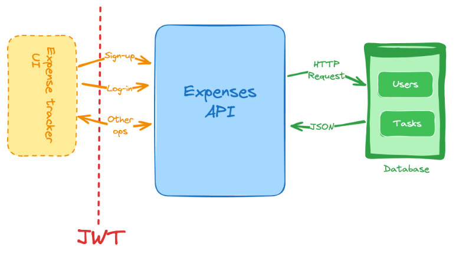

# Descripción del proyecto

Construye una API para una aplicación de control de gastos. Esta API debería permitir a los usuarios crear, leer, actualizar y borrar los gastos. Los usuarios deberían ser capaces de iniciar sesión y registrarse en la aplicación. Cada usuario debería tener su propio set de gastos.

## Características
Aquí estan las características que se deberían implementar en la API para control de gastos:

- Regristro de nuevos usuarios.
- Generar y validar tokens JWT para el manejo de autenticación y sesión de usuarios.
- Listar y filtrar los gastos pasados. Se pueden agregar los siguientes filtros:
    - Semana pasada.
    - Mes pasado.
    - Últimos 3 meses.
    - Personalizado (especifica una fecha de inicio y una fecha de fin).
- Agregar nuevo gasto.
- Remover los gastos existentes.
- Actualizar los gastos existentes.

## Restricciones
Puedes usar cualquier lenguaje de programación y marco de trabajo (framework) de tu preferencia. Puedes usar una base de datos para almacenar la información. Puedes usar cualquier ORM o librería de base de datos para interaccionar con la base de datos.

A continuación, algunas restricciones que debería seguir:

- Deber usar JWT (JSON Web Token) para proteger los puntos finales (endpoints) e identificar al solicitante.
- Para las diferentes categorías de gastos, puedes usar la siguiente lista (eres libre para decidir como implementar esto como parte de tu modelo de datos):
    - Comestibles.
    - Ocio.
    - Electrónica.
    - Utilidades.
    - Ropa.
    - Salud.
    - Otros.

## Publicación del proyecto
[Roadmap.sh - Backend](https://roadmap.sh/projects/expense-tracker-api)